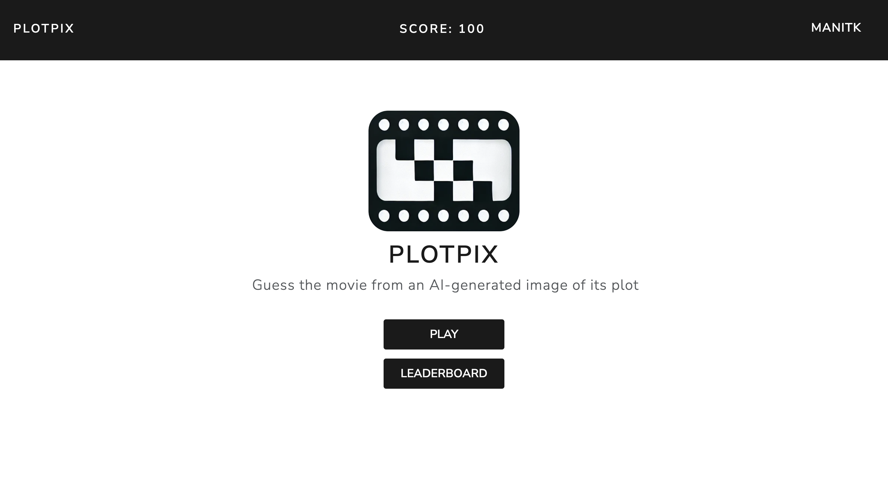
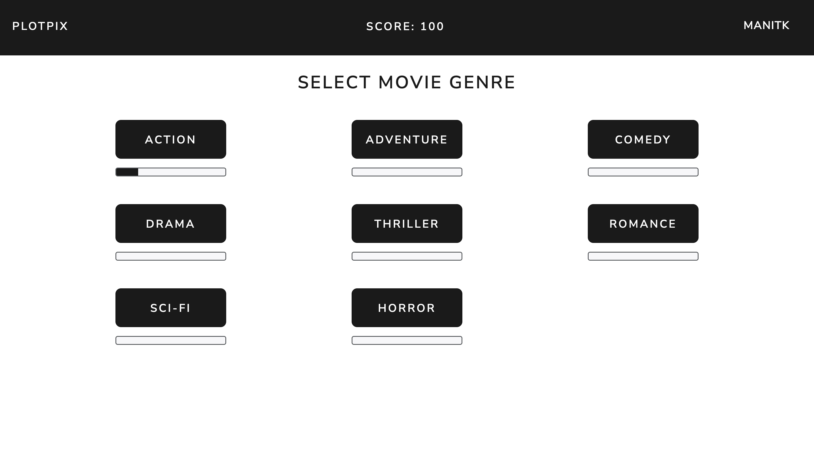
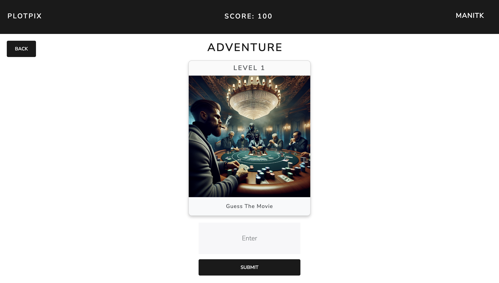
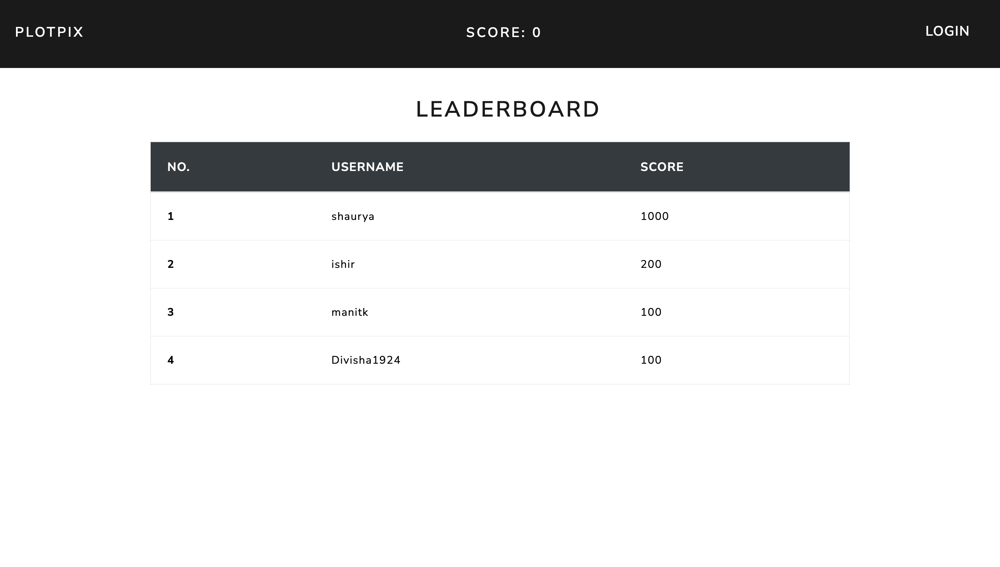

# PlotPix
A movie guessing game powered by AI-generated images from DALL-E 3. Test your movie knowledge and enjoy the challenge of guessing iconic movies based on AI-created image of their plots. Play game at https://plotpix.vercel.app

## Features
- AI-generated movie images.
- Score & Progress tracking for players.
- Categories spanning multiple movie genres (Action, Adventure, Comedy, Drama, Thriller, Romance, Sci-Fi, Horror).
- Live leaderboard.

## Tech Stack
- **Frontend**: HTML, Boostrap CSSM React.js
- **Backend**: Node.js, Express.js
- **Database**: MongoDB Atlas
- **AI Integration**: DALL-E 3 API
- **Hosting**: Vercel

## Screenshots

### Home Page

### Genre Page

### Level Page

### Leaderboard

